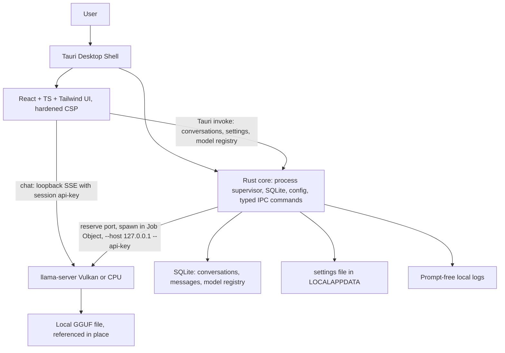

# Omnira Architecture

This document describes the MVP architecture. It encodes decisions that are
locked; changing any of them requires an explicit new decision recorded here,
not silent drift during implementation.

## 1. Overview

Omnira MVP is a Tauri 2 desktop application. A **Rust core** inside the Tauri
process owns process supervision, SQLite persistence, configuration, logging,
and typed IPC. The Rust core spawns and supervises a bundled `llama-server`
(llama.cpp) child process for GGUF chat inference.

There is **no separate backend process and no Python runtime**. The Rust core
inside the Tauri process is the sole orchestrator. Historical context for an
earlier Python/FastAPI sidecar design is recorded in
[ADR 0001](adr/0001-rust-tauri-core-orchestrator.md).

## 2. Layers

### Tauri shell + React frontend

- React + TypeScript + Tailwind CSS single-page app inside the Tauri webview
  (WebView2 on Windows).
- MVP screens: Chat, Models, Settings, Advanced Diagnostics.
- The webview is hardened per `docs/local-security-boundary.md`: strict CSP
  (production uses `127.0.0.1` loopback only for chat; dev merges
  `tauri.dev.conf.json` for Vite/HMR), no remote content, no arbitrary
  navigation, sanitized markdown rendering with raw HTML disabled, devtools
  disabled in production release builds.

### Rust core (inside the Tauri process)

Module boundaries (in `apps/desktop/src-tauri/src/`):

- `process/` -- OS-specific process supervision. Windows Job Object creation
  (`KILL_ON_JOB_CLOSE`), spawn, health gating, shutdown. This is the isolation
  seam for future macOS/Linux support.
- `runtime/` -- llama-server lifecycle: runtime variant selection (Vulkan ->
  CPU fallback), port reservation, argument construction, health polling,
  GGUF header sanity check and metadata extraction.
- `storage/` -- SQLite (rusqlite): conversations, messages, model registry.
- `config/` -- human-readable settings file under `%LOCALAPPDATA%\Omnira\config\`.
- `logging/` -- prompt-free local logs under `%LOCALAPPDATA%\Omnira\logs\`.
- `diagnostics/` -- status snapshots, log tail access, redacted export.
- `errors/` -- the error taxonomy and normalization for lifecycle errors.
- `commands/` -- the typed Tauri IPC command surface.

### Managed runtime: llama-server

- Bundled, pinned llama.cpp `llama-server` Windows builds: **Vulkan** (GPU on
  NVIDIA/AMD/Intel) and **CPU/AVX2** (universal fallback). Vulkan is tried
  first; on health-check failure the core falls back to CPU and records the
  working variant in config. No CUDA in MVP (first planned post-MVP runtime
  addition; see `docs/runtimes-and-routing.md`).
- Started with `--host 127.0.0.1 --api-key <session-secret> --port <reserved>`.
- Chat uses the OpenAI-compatible `/v1/chat/completions` endpoint, which applies
  the chat template embedded in GGUF metadata. Omnira never implements prompt
  templating itself.

## 3. Chat data path

Primary design: the frontend calls `llama-server`'s `/v1/chat/completions`
directly over loopback HTTP, obtaining host, port, and the session api-key via
a Tauri command at startup, and consumes the SSE stream via `fetch` +
`ReadableStream`. Cancellation is a client-side `AbortController`.

**Approved architecture-level fallback:** if the direct path is blocked by
webview-origin (CORS) restrictions -- verified by a spike at the start of
Phase 3 against the pinned release -- the Rust core ships a minimal streaming
path instead: a `chat_stream` command that performs the HTTP request and
forwards chunks to the frontend as Tauri events, plus a `chat_cancel` command.
Both paths present the same frontend-facing contract (a stream of token chunks
plus a terminal status), so persistence, error handling, and UI are identical
under either outcome.

**Spike outcome (recorded):** verified against the pinned release (b9859).
llama-server answers the CORS preflight from the Tauri webview origin
(`http://tauri.localhost`) with `Access-Control-Allow-Origin` echoing the
origin and `Access-Control-Allow-Headers: *`, so the **direct path ships as
primary**. The `chat_stream`/`chat_cancel` proxy remains implemented in the
Rust core and engages automatically at runtime if a direct fetch is ever
blocked at the network layer.

Non-chat concerns (conversations, settings, model registry, diagnostics) always
go through typed Tauri commands backed by the Rust core, never HTTP.

## 4. Process lifetime

- The Rust core creates a **Windows Job Object** with
  `JOB_OBJECT_LIMIT_KILL_ON_JOB_CLOSE` and assigns `llama-server` to it at spawn
  time. `llama-server` is a direct child of the Tauri process, so job membership
  is established exactly once, in one place.
- This guarantees no orphaned `llama-server.exe` even if Omnira crashes or is
  force-killed: when the last job handle closes (process death includes handle
  cleanup), Windows kills the job's processes.
- Normal shutdown also terminates the child explicitly and waits briefly for
  clean exit.

## 5. Port allocation

`llama-server` is the HTTP server; the Rust core does not bind the serving
port. Mechanism:

1. Rust binds a loopback TCP socket to port 0, reads the OS-assigned port, and
   releases the socket.
2. Rust immediately spawns `llama-server` with that explicit `--port`.
3. The window between release and spawn is a real (if rare) race: a bind
   failure is detected via process exit or failed health check, and retried
   with a freshly reserved port up to 3 attempts before surfacing
   `RuntimeFailedToStart`.

Do not assume `llama-server` supports port 0 self-assignment; do not scrape the
port from log output.

## 6. Concurrency and context

- **One loaded model, one active generation at a time.** Selecting a different
  model stops and restarts `llama-server`. Conversation history persists in
  SQLite independently; only a live generation is interrupted. Sending while
  generating is disabled in the UI and rejected at the API.
- **Context overflow:** oldest-first truncation. The Rust core knows the runtime
  context size (it sets `--ctx-size` and reads GGUF metadata during the header
  sanity check) and exposes `context_chars_budget` -- a conservative character
  budget derived via a fixed ~3 chars/token approximation with headroom for the
  response -- through a Tauri command. The frontend truncates against that
  budget and shows a subtle "earlier messages not included" notice. No tokenizer
  dependency in MVP. Residual overflow errors from llama-server map to a
  friendly "conversation too long" message.

## 7. Model handling

- Models are **referenced in place**; Omnira never copies model files by
  default. Removing a model from Omnira removes only the registry entry.
- Before launch, the Rust core verifies the GGUF magic bytes/header and extracts
  basic metadata (including trained context length). Corrupt or renamed files
  produce a clear `ModelFormatInvalid` error at selection time instead of a
  confusing runtime crash.
- Missing files (moved or deleted since registration) surface a
  `ModelFileMissing` warning on the Models screen.

## 8. Error taxonomy ownership

Defined in `docs/chat-provider.md`. Ownership split:

- **Rust core** normalizes lifecycle and process errors: `RuntimeMissing`,
  `RuntimeFailedToStart`, `ModelFileMissing`, `ModelFormatInvalid`,
  `ModelLoadFailed`, `InsufficientMemory`, `BackendUnavailable`,
  `UnknownRuntimeError`. Surfaced as typed command errors/events.
- **One dedicated frontend module** (or the Rust `chat_stream` path if the proxy
  fallback ships) maps streaming-time errors: `GenerationCancelled`,
  `GenerationFailed`, `UnauthorizedLocalRequest`.

No error strings are invented ad hoc anywhere else.

## 9. Data locations

Everything lives under `%LOCALAPPDATA%\Omnira\`:

- `config\settings.json` -- human-readable preferences
- `data\omnira.db` -- SQLite structured state
- `logs\` -- prompt-free local logs
- `diagnostics\` -- optional redacted export bundles

No roaming profile sync. See `docs/data-ownership-and-storage.md`.

## 10. Future evolution

The Rust core's `process/`, `runtime/`, and provider seams are designed so that
additional runtimes (CUDA llama.cpp variant, Windows ML/ONNX workers,
CUDA/TensorRT workers) are additive, not architectural changes. The long-term
multi-runtime routing design lives in `docs/runtimes-and-routing.md`.
