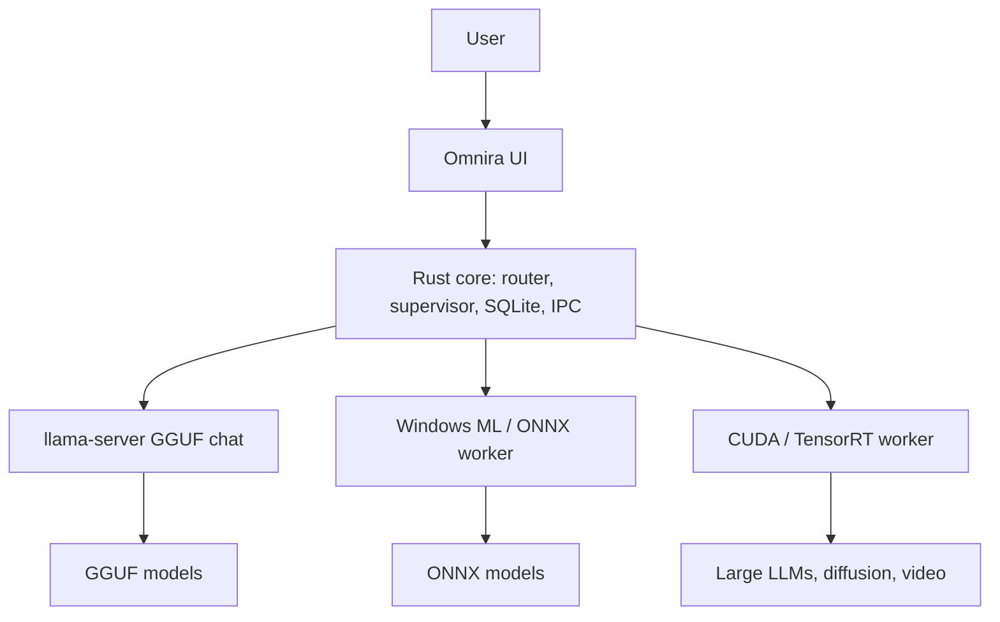

# Runtimes and Routing -- Long-Term Strategy

This document describes Omnira's long-term multi-runtime strategy. **None of
this expands MVP scope.** The MVP ships pillar 1 only (llama.cpp/GGUF chat via
managed llama-server, Vulkan + CPU). This document exists so post-MVP phases
extend the architecture instead of redesigning it.

## 1. The principle

Omnira does not run every model in one engine. It **routes model type +
modality + hardware to the best-fit runtime worker**, supervised by the Rust
core. The default UX never exposes routing internals; Advanced Diagnostics may.

"Run any open-source model" means broad orchestrated support across runtimes,
not one universal engine.

## 2. Three runtime pillars

| Pillar | Engine | Primary use | Status |
|---|---|---|---|
| **LLM** | llama.cpp / GGUF (`llama-server`) | Chat, tools/agents, code, reasoning | **MVP ships this pillar only** (Vulkan + CPU; CUDA is the first post-MVP addition) |
| **Windows-native** | Windows ML / ONNX | Vision (classification, detection, segmentation); audio (ASR, TTS); diffusion components (UNet, VAE, schedulers); NPU acceleration on Copilot+ PCs | Post-MVP; requires `OnnxProvider` / Windows ML integration |
| **High-performance GPU** | CUDA / TensorRT | Large LLMs (Gemma, Llama 3, DeepSeek); heavy diffusion; video generation | Post-MVP; CUDA llama.cpp variant first, then diffusion/video workers |

Pillar preferences:

- **llama.cpp/GGUF** remains the preferred path for local LLM chat and agent
  workloads unless the CUDA tier is explicitly selected or auto-routed.
- **Windows ML** is the preferred path for ONNX and Copilot+ NPU workloads on
  Windows.
- **CUDA/TensorRT** is the preferred path for heavy GPU workloads where
  Windows ML is not the right fit.

## 3. Routing (post-MVP)

The Rust core will maintain a runtime router:

- **Inputs:** model format (GGUF, ONNX, safetensors...), modality (text,
  image, audio, video), file metadata, detected hardware (NPU / NVIDIA GPU /
  other GPU / CPU).
- **Output:** selected runtime worker + acceleration tier.
- Routing decisions are logged and visible in Advanced Diagnostics; the main
  UI shows only task-oriented status ("Running locally").

Hardware-aware routing arrives incrementally starting Phase 6: prefer NPU on
Copilot+ PCs for ONNX workloads, prefer CUDA on NVIDIA for heavy workloads,
fall back to Vulkan and then CPU.

In the MVP, "routing" degenerates to the fixed Vulkan -> CPU selection for a
single worker type, implemented so additional backends are additive data, not
architectural changes.

## 4. Provider abstraction growth

MVP implements **ChatProvider only** (`LlamaServerChatProvider`; see
`docs/chat-provider.md`). Post-MVP adds narrow provider interfaces per feature,
documented now and implemented only when their phase begins:

- `ImageProvider`
- `VideoProvider`
- `SpeechToTextProvider`
- `TextToSpeechProvider`
- `VisionProvider`
- `OnnxProvider` (Windows ML path)
- `EmbeddingProvider`
- `RagProvider`
- `ToolAgentProvider`
- `WorkflowProvider`
- `MusicAudioProvider`
- `WebSearchProvider` (network-capable; requires the permission model in
  `docs/privacy.md` before design)

Each provider owns spawn/supervise/stream/cancel/error-reporting for its
worker. The Rust core owns routing, registry, persistence, and IPC.

## 5. Post-MVP phase order

See `docs/roadmap.md` for the full table. Summary: CUDA LLM (6) -> image (7)
-> Windows ML/ONNX (8) -> video (9) -> agents/RAG (10) -> voice (11) ->
plugin ecosystem (12). CUDA for LLMs is deliberately first: it is the single
biggest expected performance gap for NVIDIA users on the MVP's Vulkan path.

## 6. Integration notes per pillar

- **CUDA llama.cpp (Phase 6):** same `llama-server` supervision model; the
  CUDA build becomes a third runtime variant with hardware detection choosing
  CUDA > Vulkan > CPU on NVIDIA machines. Distribution (installer size vs.
  optional acceleration pack) is decided with the update strategy
  (`docs/roadmap.md`).
- **Windows ML / ONNX (Phase 8):** an `OnnxProvider` hosting ONNX models via
  Windows ML, gaining NPU acceleration on Copilot+ hardware. Worker process
  supervision reuses the `process/` seam.
- **CUDA/TensorRT diffusion and video (Phases 7/9):** managed worker processes
  (potentially ComfyUI or a purpose-built worker) behind `ImageProvider` /
  `VideoProvider`. ComfyUI and similar workflow engines integrate as **managed
  workers**, never as the default beginner UX.

## 7. Guardrails

- No pillar 2 or 3 code lands before its phase begins.
- New runtimes must not add default network calls; the privacy defaults in
  `docs/privacy.md` are non-negotiable.
- Every new worker gets the same treatment as llama-server: loopback-only,
  authenticated if it exposes an API, supervised under a Job Object, no
  orphaned processes.
