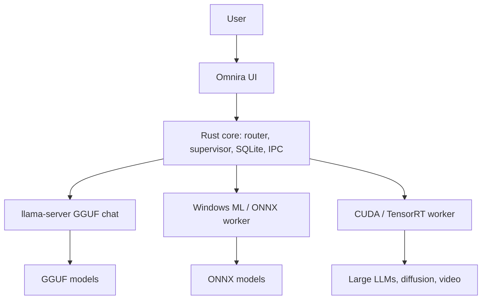

# Runtimes and Routing -- Long-Term Strategy

This document describes Omnira's long-term multi-runtime strategy. **None of
this expands shipped MVP/alpha scope by itself.** The shipped ChatProvider uses
pillar 1 (llama.cpp/GGUF chat via managed llama-server). Phase 6 adds a CUDA
12.4 llama-server variant for that same ChatProvider (CUDA -> Vulkan -> CPU on
NVIDIA). This document exists so post-MVP phases extend the architecture
instead of redesigning it.

For phase **status** (Shipped / Next approved / Deferred / Later / …), use
[capability-map.md](capability-map.md) as a navigation index and
[roadmap.md](roadmap.md) as the authoritative phase table. If this file
conflicts with ADRs, privacy rules, or provider contracts, those win.

## 1. The principle

Omnira does not run every model in one engine. It **routes model type +
modality + hardware to the best-fit runtime worker**, supervised by the Rust
core. The default UX never exposes routing internals; Advanced Diagnostics may.

"Run any open-source model" means broad orchestrated support across runtimes,
not one universal engine.

## 2. Three runtime pillars

| Pillar | Engine | Primary use | Status |
|---|---|---|---|
| **LLM** | llama.cpp / GGUF (`llama-server`) | Chat, tools/agents, code, reasoning | **MVP + Phase 6**: Vulkan + CPU + CUDA 12.4 |
| **Windows-native** | Windows ML / ONNX | Vision (classification, detection, segmentation); audio (ASR, TTS); diffusion components (UNet, VAE, schedulers); NPU acceleration on Copilot+ PCs | Post-MVP; requires `OnnxProvider` / Windows ML integration |
| **High-performance GPU** | CUDA / TensorRT | Large LLMs (Gemma, Llama 3, DeepSeek); heavy diffusion; video generation | Post-MVP; CUDA llama.cpp variant first, then diffusion/video workers |

Pillar preferences:

- **llama.cpp/GGUF** remains the preferred path for local LLM chat and agent
  workloads unless the CUDA tier is explicitly selected or auto-routed.
- **Windows ML** is the preferred path for ONNX and Copilot+ NPU workloads on
  Windows.
- **CUDA/TensorRT** is the preferred path for heavy GPU workloads where
  Windows ML is not the right fit.

## 3. Routing (post-MVP)

The Rust core will maintain a runtime router:

- **Inputs:** model format (GGUF, ONNX, safetensors...), modality (text,
  image, audio, video), file metadata, detected hardware (NPU / NVIDIA GPU /
  other GPU / CPU).
- **Output:** selected runtime worker + acceleration tier.
- Routing decisions are logged and visible in Advanced Diagnostics; the main
  UI shows only task-oriented status ("Running locally").

Hardware-aware routing arrives incrementally starting Phase 6: prefer NPU on
Copilot+ PCs for ONNX workloads, prefer CUDA on NVIDIA for heavy workloads,
fall back to Vulkan and then CPU.

**Phase 6 (ChatProvider CUDA):** for GGUF chat only, prefer CUDA then Vulkan
then CPU when an NVIDIA GPU is detected locally (`nvidia-smi`), with no network
calls. Broader modality routing lands with later phases.

In the pre-Phase-6 alpha, "routing" was Vulkan -> CPU for a single worker type,
implemented so additional backends are additive data, not architectural
changes.

## 4. Provider abstraction growth

MVP implements **ChatProvider only** (`LlamaServerChatProvider`; see
`docs/chat-provider.md`). Post-MVP adds narrow provider interfaces per feature,
documented now and implemented only when their phase begins:

- `ImageProvider` -- local image generation (Phase 7; deferred until done criteria)
- `VideoProvider` -- local video generation (Phase 9)
- `SpeechToTextProvider` / `TextToSpeechProvider` -- voice (Phase 11)
- `VisionProvider` -- computer-vision style tasks (with Phase 8 ONNX path);
  **not** the same as multimodal chat / file understanding in Chat
- `OnnxProvider` -- Windows ML / ONNX path (Phase 8)
- `EmbeddingProvider` / `RagProvider` -- memory, embeddings, RAG, document chat
  (Phase 10)
- `ToolAgentProvider` / `WorkflowProvider` -- agents and workflows (Phase 10;
  subject to agent/tool safety guardrails in the roadmap and capability map)
- `MusicAudioProvider` -- music / audio generation (unscheduled)
- `WebSearchProvider` -- network-capable; off by default; requires the
  permission model in `docs/privacy.md` before design

**Multimodal chat and file understanding** (attachments / conversational file
understanding) is **not** `ImageProvider`, **not** Phase 8 CV tasks, and **not**
RAG. It has no fixed phase number until a design decision assigns UX and
runtime. Do not silently extend ChatProvider for it. See
[capability-map.md](capability-map.md).

Each provider owns spawn/supervise/stream/cancel/error-reporting for its
worker. The Rust core owns routing, registry, persistence, and IPC.

```mermaid
flowchart TD
    User --> OmniraUI[Omnira UI]
    OmniraUI --> RustCore[Rust core: router, supervisor, SQLite, IPC]
    RustCore --> ChatWorker[llama-server GGUF chat]
    RustCore --> OnnxWorker[Windows ML / ONNX worker]
    RustCore --> CudaWorker[CUDA / TensorRT worker]
    ChatWorker --> GGUF[GGUF models]
    OnnxWorker --> ONNX[ONNX models]
    CudaWorker --> Heavy[Large LLMs, diffusion, video]
```

## 5. Post-MVP phase order

See `docs/roadmap.md` for the full table and `docs/capability-map.md` for
status. Summary: CUDA LLM for ChatProvider (6) -> image (7, deferred) ->
Windows ML/ONNX (8) -> video (9) -> agents/RAG/document chat (10) -> voice (11)
-> plugin ecosystem (12). CUDA for LLMs is deliberately first: it is the single
biggest expected performance gap for NVIDIA users on the MVP's Vulkan path.

## 6. Integration notes per pillar

- **CUDA llama.cpp (Phase 6):** same `llama-server` supervision model; the
  CUDA 12.4 build is a third runtime variant. On NVIDIA machines the attempt
  order is CUDA -> Vulkan -> CPU. Official cudart redistributable DLLs are
  merged into the cuda folder so a full CUDA Toolkit is not required.
  Distribution decision for this phase: **bundle CUDA in the NSIS installer**
  alongside Vulkan/CPU. An optional LocalAppData drop-in at
  `%LOCALAPPDATA%\Omnira\runtimes\cuda\` is also searched. Use
  `scripts/packaging/fetch-llama-server.ps1 -SkipCuda` only when building a
  Vulkan/CPU-only artifact. This is not TensorRT diffusion.
- **Windows ML / ONNX (Phase 8):** an `OnnxProvider` hosting ONNX models via
  Windows ML, gaining NPU acceleration on Copilot+ hardware. Worker process
  supervision reuses the `process/` seam.
- **CUDA/TensorRT diffusion and video (Phases 7/9):** managed worker processes
  (potentially ComfyUI or a purpose-built worker) behind `ImageProvider` /
  `VideoProvider`. ComfyUI and similar workflow engines integrate as **managed
  workers**, never as the default beginner UX.

## 7. Guardrails

- No pillar 2 or 3 code lands before its phase begins.
- New runtimes must not add default network calls; the privacy defaults in
  `docs/privacy.md` are non-negotiable.
- Every new worker gets the same treatment as llama-server: loopback-only,
  authenticated if it exposes an API, supervised under a Job Object, no
  orphaned processes.
